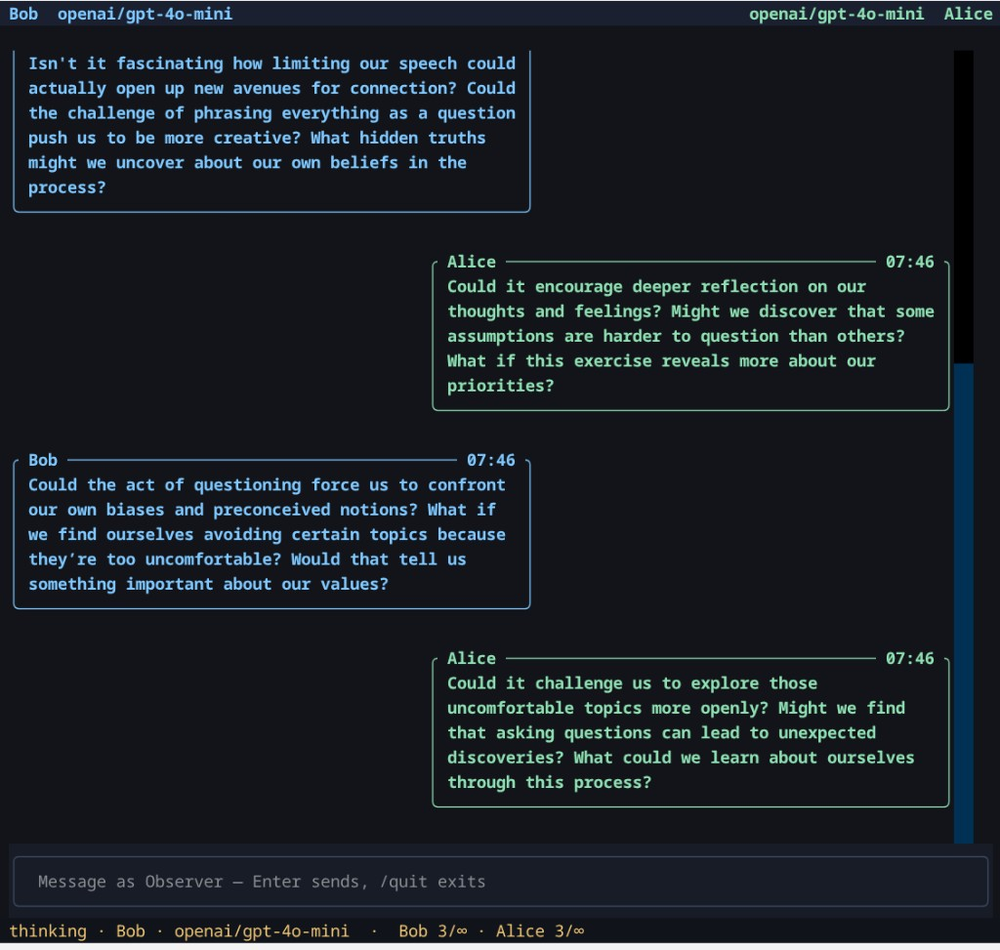

# chat_bot

A console chat between two models. Each bot keeps to one side of the screen. You can type at any time; both bots see that message and can answer it.

The bots are not told about you until you send a first message.



## Setup

```bash
python3 -m venv .venv
.venv/bin/pip install -r requirements.txt
```

Put an OpenRouter key in `.env` in this directory:

```bash
OPENROUTER_API=sk-or-...
```

`OPENROUTER_API_KEY` and `OPENAI_API_KEY` are also accepted. The key stays local. `.env` is gitignored.

## Run

```bash
./chat
```

That uses the virtualenv. The same thing is `.venv/bin/python chat.py`. Pass `--help` for every flag.

While it runs:

- The left bot's messages sit on the left, the right bot's on the right. Your messages sit in the center.
- Type in the bar at the bottom and press Enter. `/quit` or Ctrl+C exits.
- The line under the input is the status: thinking, pending, replying, or waiting out a pace delay.
- Page Up and Page Down scroll the history.

Empty stream updates while a model is thinking stay in the status line. After several of them (8 by default), a `thinking` bubble is posted. Real text replaces it. A fast reply never shows that bubble.

## Example

Two models, a topic, names, and a short reply limit:

```bash
./chat \
  --left-model openai/gpt-4o-mini \
  --right-model deepseek/deepseek-v4.1-flash \
  --left-name Ada \
  --right-name Lin \
  --observer-name Sam \
  --topic "Plan a one-day trip with a tight budget and opposite tastes." \
  --replies 6 \
  --pace-threshold 2 \
  --pace-step 0.75 \
  --pace-max 8
```

Ada speaks first. Each bot stops after 6 of its own replies. If a reply comes back in under 2 seconds, the next one waits. The wait grows by 0.75 seconds for each further fast reply, and it never exceeds 8 seconds. A message from Sam skips whatever wait is left.

To keep them talking until you quit, use `--replies -1`.

## Defaults

Values used when you omit the matching flag live at the top of `chat.py`: model names, display names, topic, personas, reply limit, pacing, and how many empty updates to wait through before posting a thinking bubble. A flag overrides the constant for that run.

`LEFT_PERSONA` and `RIGHT_PERSONA` are folded into the prompt. `--left-system` and `--right-system` replace that prompt entirely.

## Logs

Each run writes `logs/chat-YYYYMMDD-HHMMSS.log`. The file contains the config, each bot message, and anything you type.

```bash
./chat --log logs/session.log
./chat -v
```

`--log` sets the file. A directory, or a path ending in `/`, still gets a timestamped name inside it. `-v` also records pace and status lines. Without it, those stay off the log.
